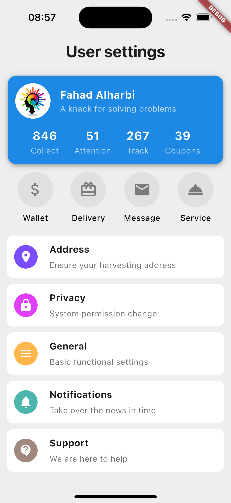

<p align="center">
   
<br/>
   <span style="font-size:30px">Assignment 10 - Implement the design</span>
</p>

<p align="center">
   <a href="https://tuwaiq.edu.sa/"></a>
   <a href="https://tuwaiq.edu.sa/"></a>
   <a href="https://tuwaiq.edu.sa/"></a>
   <a href="https://tuwaiq.edu.sa/"></a>
   <a href="https://tuwaiq.edu.sa/"></a>
   <a href="https://tuwaiq.edu.sa/"></a>
</p>
<hr/>

## Assignment Description

Implement this design in an app using Flutter, using widgets that we take in lesson today.

## Table of Contents

- [Description](#description)
- [ScreenShot](#screenshot)
- [How to run the app](#how-to-run-the-app)
- [Wrote By](#wrote-by)
- [Supervisor By](#supervisor-by)

## ScreenShot



## How to run the app

```sh
flutter run
```

## Wrote By

- Fahad Alharbi - student at Tuwaiq Flutter Bootcamp 2024

## Supervisor By

- Fahad Alazmy
- Mjd Alghamdi