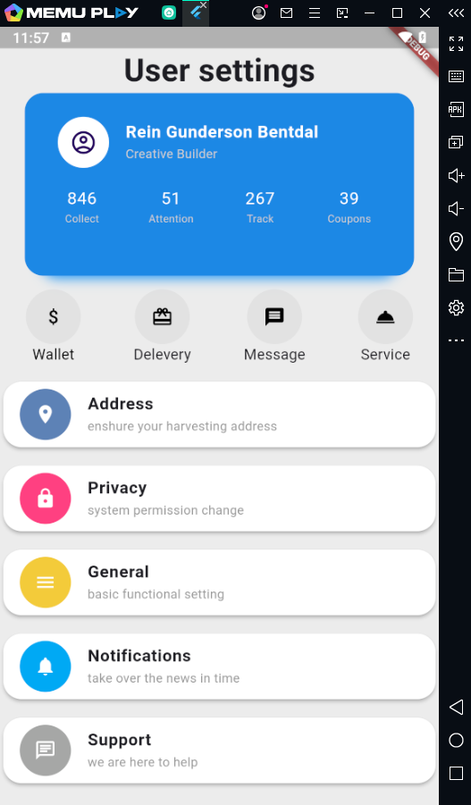

# Flutter Setting Page Example

settings page . user information display, section headers, and list tiles with leading icons and subtitles.

**Features:**
<li>User information card with name, title, and profile picture
<li>Section headers for different settings categories
<li>List tiles with leading icons and subtitles for each setting option
<li>Customizable card colors and icons

