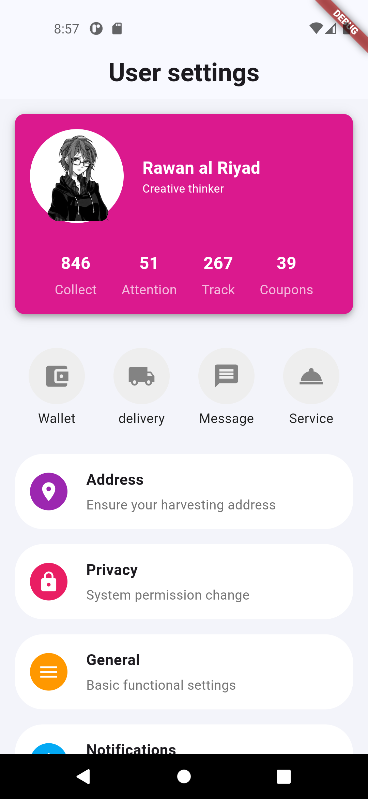
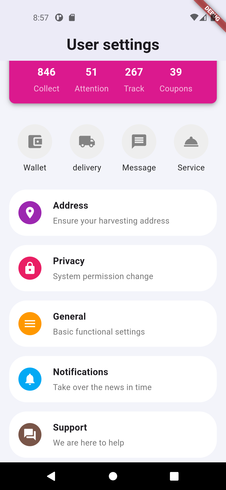

## User Settings Screen Flutter App
This Flutter project  create a simple user settings screen with a profile section 

## Features

**Profile Section:**
- Displays user information including name, title, and profile picture.
**Statistics Section:** 
- Shows user-specific statistics such as "Collect," "Attention," "Track," and "Coupons."
**Quick Actions:** 
- Includes shortcuts to "Wallet," "Delivery," "Message," and "Service" with icons and labels.
**Settings Options:** 
- Provides settings options like "Address," "Privacy," "General," "Notifications," and "Support," each enclosed in a rounded container.

## Usage

**main.dart:** 
- The main entry point of the application.

**MyApp():** 
-  Initializes the MaterialApp and sets up the basic scaffold.

**buildUserSettingsScreen():** 
- Builds the main user settings screen.
Widgets

**buildInfoColumn():**
- A function to create columns for user statistics.

**buildIconContainer():** 
- A function to create rounded containers for quick action icons.

**buildRoundedContainer():** 
- A function to create rounded containers for settings options with icons and text. 

### Customization

**Icons**: 
- Change the icons used by replacing the Icons.<icon> with your preferred icon.

**Colors:** 
- Modify the colors by adjusting the Colors.<color> in the respective widgets.

**Text**:
-  Update the text content directly within the Text() widget calls.

## Outupt

   
   

