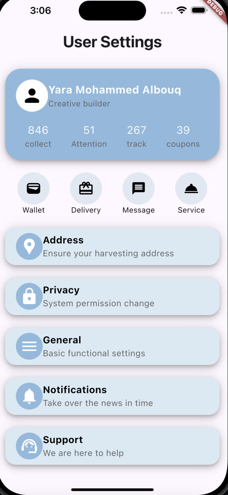

<p align="center">


# user_settings
User setting interface using **Flutter**
<p align="center">



## Overview
The "User Settings" screen includes a layout featuring rows and columns with containers that hold icons and text elements.

On the "User Settings" screen, the layout is organized as follows:
1. User Info Section:
A container displaying the user's information, including their **profile picture**, **username**, number of c**ollections**, **attention**, **track**, and **coupons**.
2. Feature Section:
Various features are presented, such as **wallet** management, **delivery** options, **messaging**, and **services**.
3. Additional Settings:
Sections for user **address**, **privacy settings,** **general settings**, **notifications**. and **support for help**


## Getting started
 ### Dependencies
You need to install Flutter

### Executing program
1- Fork the Repository.
2- Copy url then go to terminal and write: 
```
git clone ‹url›
```
3- Go to the cloned project using:
```
 cd < PROJECT-NAME> /
 ``` 
4- Create a new branch and checkout this branch: 
```
git checkout -b branch-name
```
5- To create and start dart project 
```
flutter create project_name
cd project_name
code .
```

6- Now to run the program in terminal write:
```
Flutter run
```

