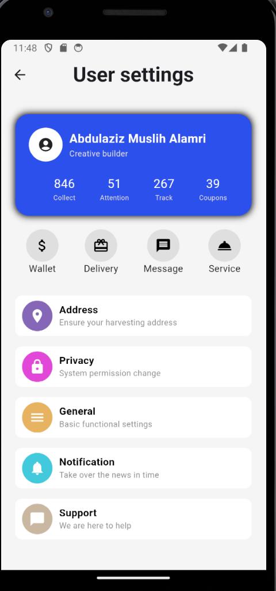
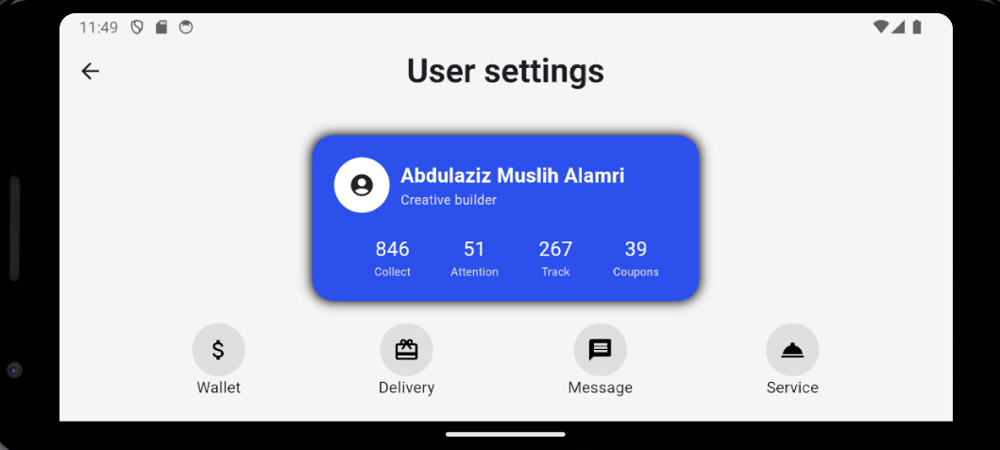
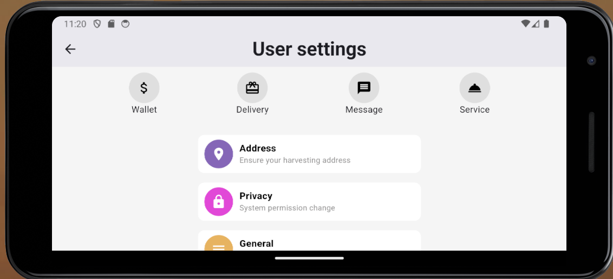

# A simple User settings page

A simple page created using Flutter for User settings

## Description

User settings page that can be used in applications to personalize settings and view other parts of an application. A simple design that is visually appealing and offers a good user experience .

## Work

- Used ListView to avoid error when phone flipped
- Used Row and Column spacing
- Used Container decoration, color, shape
- Used MainAxisAlignment and CrossAxisAlignment
- Used IceButton and BackButton
- Used SizeBox to add spaces between widgets that do not have padding attribute
- Used circle Containers to place icons in as shown in UI design

## Screenshots

## Authors
Abdulaziz Alamri

## Version History
**See commits history for more details**

## Acknowledgments
Tuwaiq Academy

