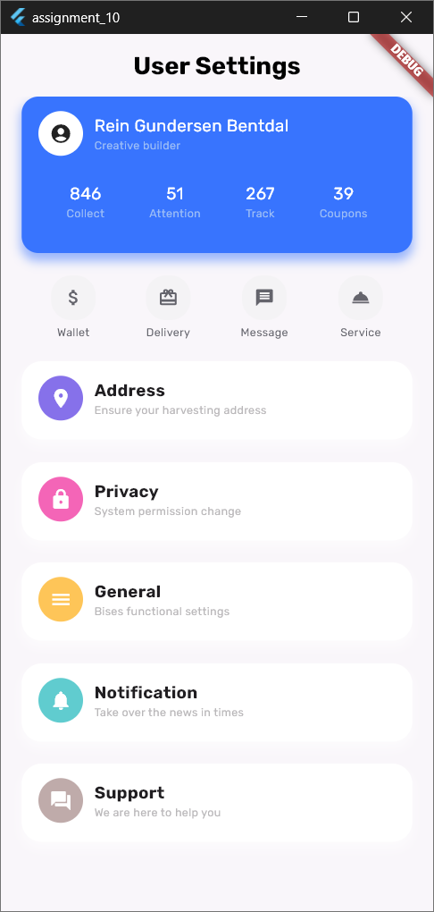

# Coupon App in Flutter

## Description
An flutter application used to review coupon, wallet, and delivery. By using custom widget etc. customIcon, customButton, and others. Also this app has functionality for routing(NOT completed yet!).

This application created to cover the flutter basics layout, column, container, elevatedButton, icon, row, scaffold, and text.

## Getting Started

### Dependencies
- Flutter SDK

### Installing
1. **Clone the repository:**
   ```bash
   git clone https://github.com/imahacs/Assignment-10
   ```
2. **Clone the repository:**
    ```bash
    cd assignment_10
     ```
3. **Install the required dependencies:**
    ```bash
    flutter pub get
    ```
4. **Ensure that you have the Flutter SDK installed.** If not, download and install it from the Flutter's official website.

## Executing Program
To run the program, use the following command:

    Flutter run

## Help
For common issues or troubleshooting:

- Ensure all dependencies are correctly installed.
- Verify that your Flutter SDK is up to date.
- Review the code and verify that structures match expected formats.
For additional help, consult the Flutter documentation or open an issue on the project's GitHub repository.

### Example Usage



## Authors
- imahacs - [GitHub Profile](https://github.com/imahacs)

## Version History
- 0.1 - Initial Release

## License
This project is licensed under the MIT License - see the [LICENSE](LICENSE.md) file for details.
.

## Acknowledgments
- Inspired by various Flutter and JSON handling tutorials.
- Thanks to the open-source community for their contributions and support.
