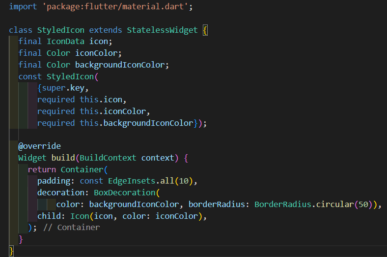
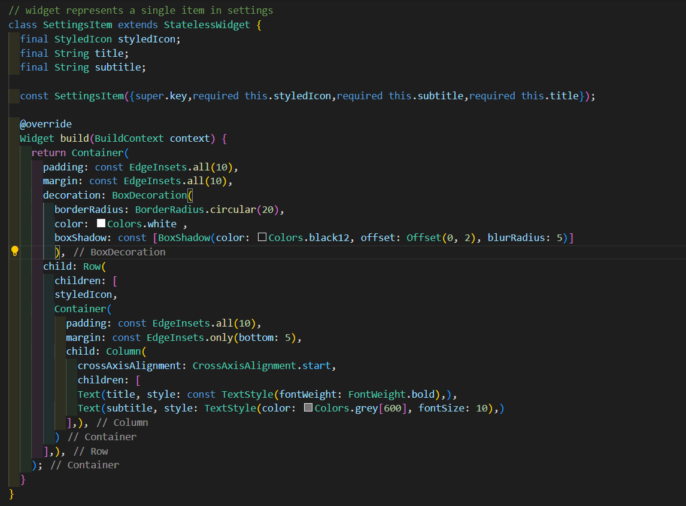

# Assignment 10 : User Settings Page ⚙️

# 1. Overview 📖
This is our first flutter assignment !!\
In this assignment, we will build and design a **user settings** page.\
In general, Settings pages should be **obvious** and **concise** to users.\
Colorful buttons and elements are a perfect addition for a better **user experience**.

# 2. Widgets Used 🎨
In this section, I will discuss the widgets in two aspects :
1. Main or Basic Widgets : Widgets that are **built-in** in flutter ✅
2. Custom Widgets : Widgets that I have **created** for a more readable code ✅

Let's get started !

## 2.1 Main "Basic" Widgets
First, I will explain what basic widgets I have used

### 2.1.1 Scaffold
`Scaffold` widget is applied whenever there is a user interface. more specifically, No user interface can be shown to user without `scaffold` widgets. They act like a **template** to start programming the app and fill in that template with many available widgets. See Image (1).

### 2.1.2 SafeArea
This widget controls the app content view to be in the safe area. `Safe area` is a common term in mobile apps development refers to the area in the phone where nothing can overlap over the phone original features like navigation bar. See Image (1).

### 2.1.3 AppBar
App bar widget represents the top horizontal bar that usually appears in the top of the page. It is used for displaying the app name or logo, and some actions or a side menu button. See Image (1).

Image (1) : Code snippit of using scaffold, SafeArea, AppBar, and Text widgets.

### 2.1.4 Text
This is the most basic and easiest widget, where you should pass to it one parameter which is the string text you want to view. Additionally, you can pass to it a `TextStyle` widget which provides more control over the text font and size. See Image (2).

### 2.1.5 Column and Row
Those are types of containers that arranges their children "inner widgets" in a special way :

- A `Row` arranges children in a **horizontal** way from left to right
- A `Column` arranges children in a **vertical** way from up to bottom

See Image (2).

Image (2) : Code snippit of using Text, Row, and Column widgets.

## 2.2 Custom Widgets
Those are the widgets that I designed specially for better code and more reusability of widgets.

### 2.2.1 statistic
Statistic widget represents the numbers in the blue container, each pair of number and label is a `Statistic`.
It takes two parameters `value` and `label` both as Strings. See Image (3).

Image (3) : Code snippit of using statistic widget

### 2.2.1 styled icon
I named the circled colored icon in the page as a `Styled Icon`. See Image (4)

Image (4) : Code snippit of StyledIcon widget

### 2.2.1 settings item
This widget represents the white rectangles that represents a settings item. Since they're all the same style with different configrations liek the color and text, I decided to create a widget for a `Settings Item`. See Image (5).

Image (5) : Code snippit of SettingsItem widget

# 3. Output ⭐

 

# 4. Conclusion 🏁
This assignment improved my understanding of flutter widgets and its usages 👍

**By : Yaser Alkhayyat**